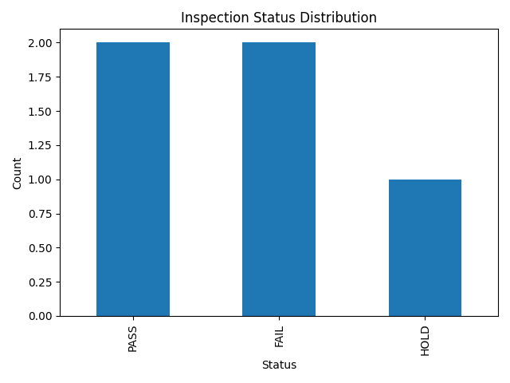
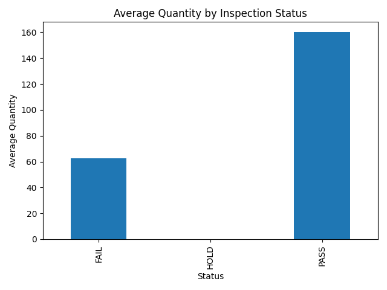

# Product Inspection Automation & Dashboard

An end-to-end data pipeline that takes raw product inspection records, cleans and analyzes them with Pandas, loads results into SQLite, and serves them through a Flask API and dashboard.

## What it does

- **Extract & clean**: reads raw inspection CSVs, drops duplicates, fills missing values, normalizes types
- **Analyze**: aggregates inspection status counts and total quantities inspected
- **Load**: writes cleaned data into a SQLite database and runs SQL aggregation queries against it
- **Report**: auto-generates a bar chart and a plain-text summary report from each run
- **Serve**: exposes the cleaned data through a Flask REST API (`/api/summary`, with optional status filtering) and a simple HTML dashboard

## Tech stack

Python · Pandas · SQLite · Flask · Matplotlib

## Project structure

```
.
├── src/
│   ├── main.py              # CLI: run the clean → analyze → load → report pipeline
│   ├── eda.py                # exploratory data analysis
│   └── preprocess_data.py    # data cleaning / preprocessing utilities
├── web/
│   ├── app.py                # Flask API + dashboard
│   └── templates/index.html  # dashboard page
├── data/                      # raw + cleaned data, SQLite DB, generated report/chart
└── docs/                      # screenshots
```

## Running it

Pipeline (cleans data, loads it into SQLite, generates a chart + report):
```bash
pip install pandas matplotlib
python src/main.py
```

Dashboard (serves the cleaned data):
```bash
pip install flask pandas
python web/app.py
```
Then visit `http://localhost:5000` for the dashboard, or `http://localhost:5000/api/summary` for the raw JSON (add `?status=<value>` to filter).

## Screenshots




## What this project demonstrates

- Structuring a small pipeline into clear extract/transform/load stages instead of one script that does everything
- Moving data between a CSV-based analysis layer and a queryable SQLite store
- Building a REST API on top of a Pandas-backed dataset, with filtering support
- Separating data, backend, and presentation concerns into distinct layers
